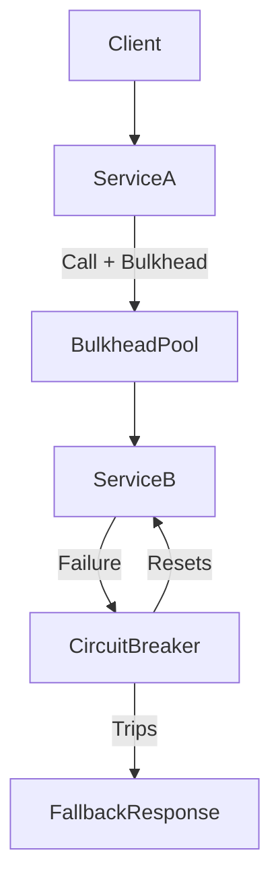
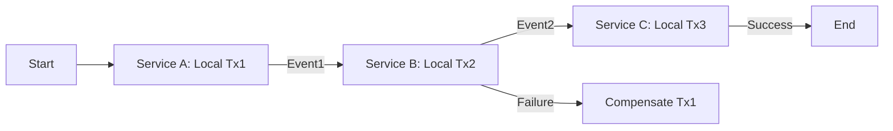

# Architectural Patterns for Scale

A consolidated overview of key patterns—**CQRS**, **Fan‑out + Worker Pool**, **Strangler Fig**, **Bulkhead**, **Circuit breaker** and **Saga**—including descriptions and Mermaid diagrams.

---

## 1. CQRS (Command Query Responsibility Segregation)

**How It Works**

* Commands (writes) and Queries (reads) use separate models and often separate data stores.
* After a command commits, it emits an event (e.g., via a message broker) that updates the read model asynchronously.

**Why It Scales**

* **Independent Scaling**: Scale your read tier (e.g., multiple replicas, caches) without touching the write tier.
* **Optimized Data Models**: The read model can be highly denormalized or even pushed into a specialized store (search index, in‑memory cache) for ultra‑fast queries.
* **Clear Separation of Concerns**: Simplifies the code paths—command handlers focus on business logic, query handlers on retrieval.

**Caveats**

* **Eventual Consistency**: Reads may be stale immediately after writes; UX must handle this gracefully.
* **Operational Complexity**: You need to monitor two data pipelines and ensure event delivery.

**Diagram**

---

## 2. Fan‑out + Worker Pool

**How It Works**

* An incoming task (e.g., a bulk job, email blast, report generation) is **fanned out** into many discrete work items.
* A **worker pool**—a group of horizontally scalable worker processes—consumes from a queue, processes items in parallel, and writes results back.

**Why It Scales**

* **Elastic Throughput**: You can increase or decrease the number of workers based on queue depth or latency SLOs.
* **Failure Isolation**: If one worker crashes on a bad item, the rest of the pipeline continues; dead‑letter queues capture failures for later replay.
* **Backpressure Control**: Queues buffer spikes, preventing downstream overload.

**Caveats**

* **Ordering Concerns**: If order matters, you need partitioned queues or sequence tracking.
* **Idempotency**: Workers must safely reprocess items without side effects.

**Diagram**

---

## 3. Strangler Fig

**How It Works**

* You incrementally **replace** parts of a legacy system by **wrapping** it with a new service or module.
* Traffic for a given feature “strangles” the old code path, redirecting progressively more calls to the new implementation until the legacy code can be decommissioned.

**Why It Scales**

* **Low Risk Migration**: You avoid big‑bang rewrites; each piece can be tested and rolled back independently.
* **Continuous Delivery**: New functionality lives alongside legacy, allowing faster iteration and gradual sunsetting of old code.
* **Evolving Architecture**: Enables you to apply modern patterns (e.g., microservices, event‑driven) one component at a time.

**Caveats**

* **Routing Complexity**: Requires a façade or proxy layer to split traffic.
* **Dual-Maintenance**: For a period, you must maintain both old and new codebases.

**Diagram**

---

## 4. Bulkhead & Circuit Breaker

**How It Works**

* **Bulkhead**: Isolates resources (threads, connections) into compartments so failures in one compartment don’t affect others.
* **Circuit Breaker**: Wraps calls to external or risky services; trips to stop calls when failures exceed thresholds, then resets after a cooldown.

**Why It Scales**

* **Failure Isolation**: Prevents cascading failures; one slow or failing component doesn’t degrade whole system.
* **Resilience**: Circuit breakers protect service endpoints, enabling graceful degradation and automated recovery.

**Caveats**

* **Configuration Complexity**: Requires tuning thresholds and timeouts per service characteristics.
* **Monitoring Overhead**: Must track health metrics and state of each circuit/bulkhead.

**Diagram**

---

## 5. Saga (Distributed Transactions)

**How It Works**

* Splits a distributed transaction into a sequence of local transactions across multiple services.
* Each service publishes an event; subsequent services subscribe and perform compensating actions on failure.

**Why It Scales**

* **Data Consistency**: Maintains eventual consistency without locking across services.
* **Loose Coupling**: Services interact via events, reducing synchronous dependencies.

**Caveats**

* **Complex Compensation Logic**: Must handle rollback operations carefully.
* **Traceability**: Requires robust tracking to correlate distributed steps and failures.

**Diagram**

